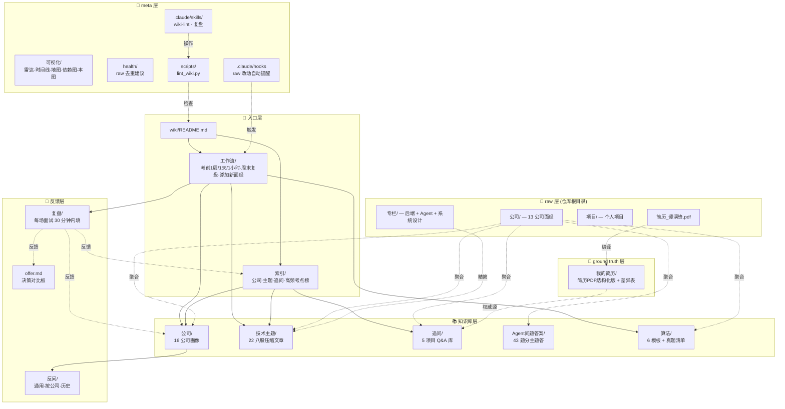

# wiki 自身鸟瞰图

> 一张图理解 wiki 内部分层。每层职责单一，跨层的依赖只有箭头方向。

## 五层架构

## 解读

- **L0 入口层**：所有人（你 / Claude / 未来的接手者）从这进。READ 顺序通常 `README → 工作流（按当下场景）→ 索引/主题（按知识域）`
- **L1 ground truth**：简历 PDF 是世界观。任何 wiki 内容跟简历冲突，简历赢
- **L2 知识库**：5 个并行子库——按"看问题的视角"分（按公司 / 按主题 / 按项目 / 按 Agent / 按算法）；同一信息会被多视角索引（一个考点既出现在公司画像，也在主题文章，也在算法清单）
- **L3 反馈层**：写入而非读取。复盘 → 自评 -1 → 高频榜重排，闭环
- **L4 meta 层**：自我维护。脚本检查、hook 提醒、skill 操作

## 数据流向（实箭头 = 直接引用，虚箭头 = 编译/派生关系）

- 所有 raw（公司面经 / 专栏 / PDF）→ 通过 LLM 编译 → 进入 L1 / L2
- L1 简历 → 提供项目权威定义给 L2 追问/
- L2 知识库 → 通过 索引/ 暴露给 L0 入口
- L3 复盘 → 反向更新 L0（高频榜）和 L2（公司画像）
- L4 工具 → 监控 / 维护整个 wiki

## 一句话总结

> raw 是事实，L1-L2 是结构化整理，L0 让人能找到，L3 让 wiki 自己进化，L4 防它腐烂。
