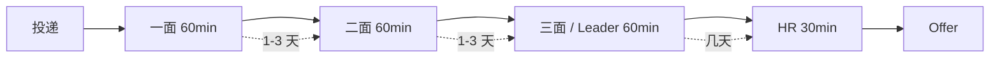
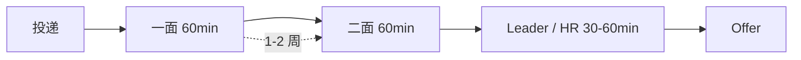
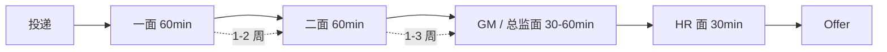
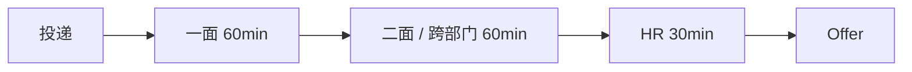

# 公司面试流程图

> 代表公司的面试轮次和典型周期。具体每家见 [[索引/公司索引]]。

## 字节

- 节奏快，全程通常 1-2 周
- 实习 / 暑期：3 轮技术 + HR；秋招：可能加交叉面

## 快手

- 整体偏稳，2-3 轮
- 大数据 / 引擎方向技术深度高

## 腾讯

- 周期较长，2-4 周
- 总监面权重大，BG 间差异明显（CSIG / WXG / IEG）

## 蔚来

- 流程较轻，2-3 轮
- 车端与互联网思路结合，跨部门协作多

## 关联
- [[索引/公司索引]]
- [[offer]] — 跟进各公司当前轮次状态
- [[反问/按公司画像]] — 每轮反问准备
