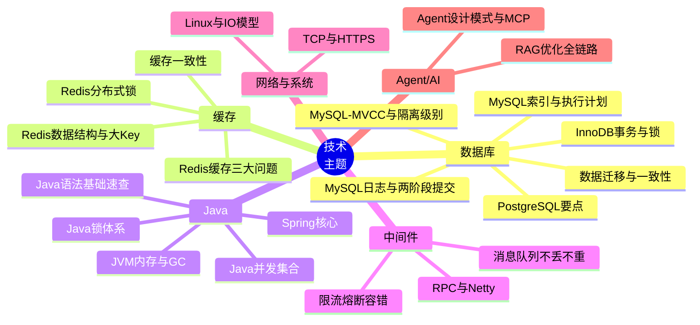

# 技术主题地图

> 22 个技术主题按"数据库 / 缓存 / Java / 中间件 / 网络 / Agent"分组。

## 复习路径

- **后端面**（蚂蚁 / 快手支付 / 字节后端）：数据库 + 缓存 + Java + 中间件
- **基础架构面**（小红书 / 字节 SRE）：Java + 中间件 + 网络与系统
- **Agent 面**（西门子方向 / 微软 Bing / 字节广告 AI）：Agent/AI + RAG 全链路 + Java 基础
- **大数据面**（快手 / TT SRE）：数据库 + Linux IO + 中间件

## 关联
- [[主题索引]]
- [[高频考点榜]]
- [[技能雷达]]
