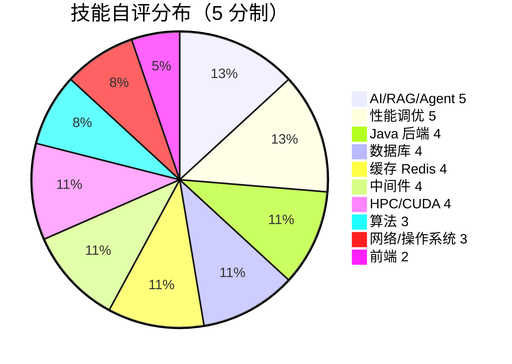
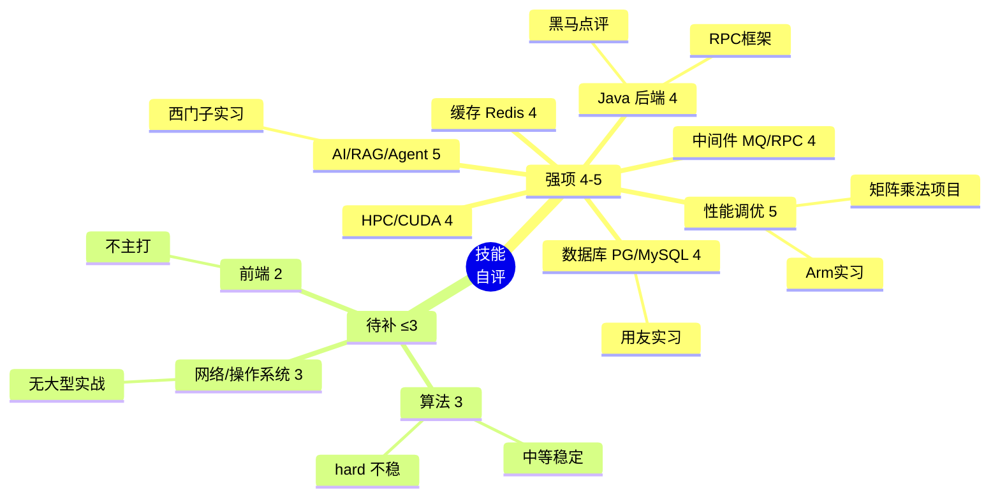

# 技能雷达

> 数据来自 [[技能清单]] 自评。Obsidian 不支持 radar，用 pie + mindmap 表达。

## 十维度自评（pie）

## 强弱分组（mindmap）

## 复习优先级

- **5 分**（AI/RAG/性能）：保持手感，复习项目细节
- **4 分**（Java/数据库/缓存/中间件/HPC）：找薄弱子主题（如 JVM 调参、Cluster 实战、Kafka 深度）
- **3 分以下**（算法/网络/前端）：面试前重点过一遍 [[算法/README]] 和 [[TCP与HTTPS]]

## 关联
- [[技能清单]]
- [[主题索引]]
- [[高频考点榜]]
