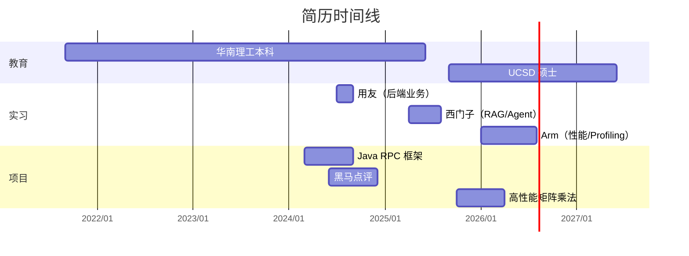

# 简历时间线

> 数据来自 [[基础信息]]。三段实习 + 教育交叠。

## 整体 Gantt

## 关键节点

- **2025/06**：本科毕业
- **2025/09**：开学 UCSD
- **2026/01**：Arm 入职
- **2026/05**（当前）：Arm 实习中，秋招准备期
- **2026/08**：Arm 实习结束 / 暑期实习窗口
- **2027/06**：硕士毕业

## 重叠点（讲故事抓手）

- 西门子 + UCSD 开学：实习项目接住完一个完整闭环再开学
- Arm + UCSD 在读：远程 + 跨时区，体现自我管理
- 三段实习覆盖三层栈：底层（Arm）+ AI（西门子）+ 业务（用友）

## 关联
- [[基础信息]]
- [[Arm实习]]
- [[西门子实习]]
- [[用友实习]]
- [[RPC框架项目]]
- [[黑马点评项目]]
- [[矩阵乘法项目]]
