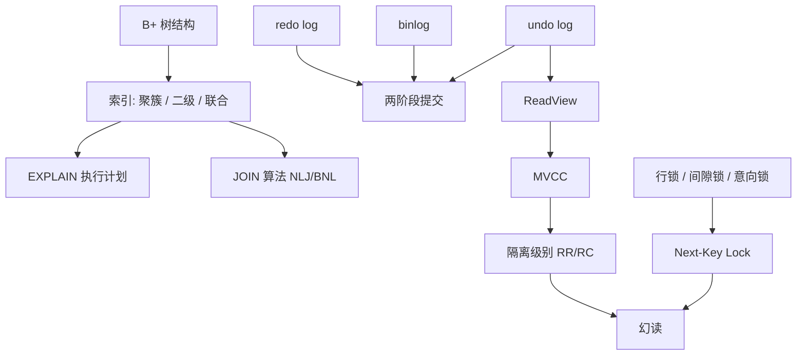
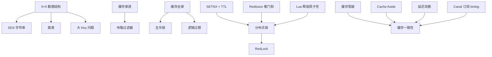
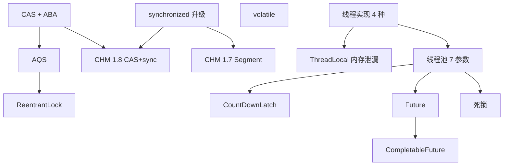
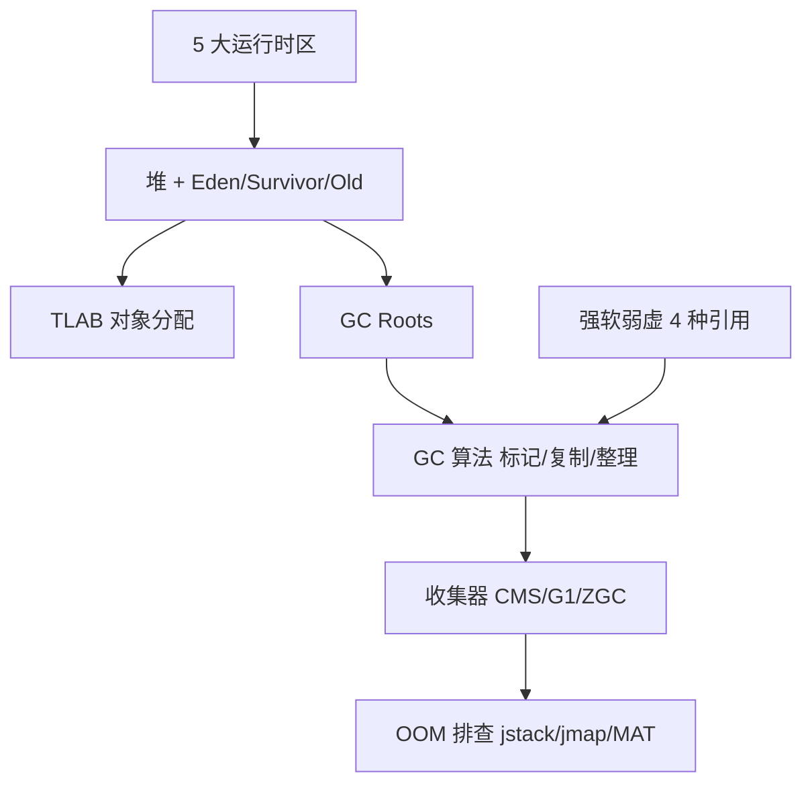
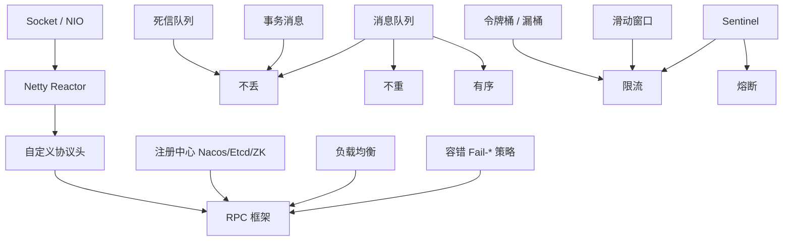
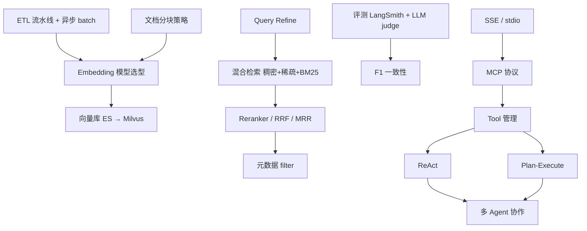

# 考点依赖图

> 主要 8 大考点之间的概念依赖。复习一个上层概念前，先确认下层概念在脑里。
> Mermaid 渲染：箭头 A → B 表示"理解 B 需要先理解 A"。

## MySQL 域

→ 详见 [[MySQL索引与执行计划]] · [[MySQL-MVCC与隔离级别]] · [[MySQL日志与两阶段提交]] · [[InnoDB事务与锁]]

## Redis 域

→ 详见 [[Redis缓存三大问题]] · [[Redis数据结构与大Key]] · [[Redis分布式锁]] · [[缓存一致性]]

## Java 并发域

→ 详见 [[Java并发集合]] · [[Java锁体系]]

## JVM 域

→ 详见 [[JVM内存与GC]] · raw [[后端技术专栏/JVM]]

## 中间件 / 分布式域

→ 详见 [[RPC与Netty]] · [[消息队列不丢不重]] · [[限流熔断容错]]

## RAG / Agent 域

→ 详见 [[RAG优化全链路]] · [[Agent设计模式与MCP]] · [[Agent问题答案/README]]

---

## 用法

- 复习前 5 分钟扫一眼对应域，确认你能从图最下层（基础）讲到最上层（应用）
- 答某个考点卡住时，回看图找上游依赖，可能是基础没打牢
- 面试官追问的时候，依赖链就是你的"为什么 / 如何 / 影响" 三步追溯路径
