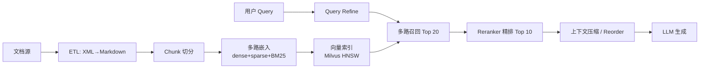

# RAG 优化全链路（概念骨架）

> 链路：文档 → 切片 → 多路嵌入 → 向量索引 → 多路召回 → Reranker → 上下文压缩 → LLM 生成。每环节都有可优化点。

> ⚠ **本文只放骨架 + 对比表 + 易错点**。具体问答 / 项目实操（76% → 92% 怎么做）请去 [[Agent问题答案/RAG]] + [[追问/西门子RAG]]。

## 端到端链路图



## 关键对比表

### Chunk 切分策略

| 策略 | 优 | 劣 |
|---|---|---|
| 固定长度 | 简单 | 断语义 |
| **语义分块** | 边界自然 | 实现复杂 |
| **滑动窗口**（重叠 10-20%）| 防边界丢失 | 冗余 |
| **层次化** | 多粒度可选 | 索引膨胀 |
| 标记符（# / ```）| 简单可控 | 限定文档类型 |

实战推荐：**层次化 + 语义 + 滑动窗口** 三者组合（500-1000 token 是常见折中）。

### Embedding 模型

| 模型 | 维度 | 模式 |
|---|---|---|
| **BGE-M3** | 1024 | dense + sparse + multi-vector，关键词强 |
| **千问3** | 4096 | 仅 dense，语义强，霸 HF 榜 |

→ 实战组合：千问3 dense + BGE-M3 sparse + BM25 三路召回。

### 向量索引：FLAT vs HNSW

| | FLAT | HNSW |
|---|---|---|
| 类型 | 暴力 | 近似 ANN |
| 复杂度 | O(N·d) | O(logN) |
| 关键参数 | — | M=16-32, efConstruction=200, ef_search=100-200 |
| 召回率 | 100% | 95%+ |
| 延迟 | 慢 | ms 级 |

> 概念区分：**KNN 是目标**（找最近 k 个），**FLAT / HNSW 是实现**。

### 向量库：Elasticsearch vs Milvus

| | ES | Milvus |
|---|---|---|
| 最大向量维度 | 1024 | 任意（千问3 4096 OK）|
| 稀疏向量 | ✗ | ✅ 原生倒排 |
| 主业 | 全文搜索 | 向量检索 |

→ 项目里换 ES → Milvus 主因：千问3 4096 维 ES 放不下 + ES 不支持 sparse。

### Reranker 选型

| | LLM Reranker (BGE-M3 / 千问 reranker) | RRF |
|---|---|---|
| 准 | 高 | 中 |
| 延迟 | 30 文档 ~2s | 几十 ms |
| 何时用 | 业务能等 | 延迟敏感 |

## 评估三维度（LangSmith）

| 维度 | 含义 | 防什么 |
|---|---|---|
| **Correctness** | 与标准答案一致 | 答错 |
| **Relevance** | 回答与问题相关 | 偏题 |
| **Groundedness** | 回答基于检索文档 | 幻觉 |

LLM judge（DeepSeek V3）打分前先与人工 AB，F1 ≥ 0.8 才采信。LangSmith trace 每个节点入参 / 出参 / 耗时，失败 case 反查链路。

## Query 优化技巧（按由轻到重）

1. **Query Refine** — 多语言 / 同义词扩写后并查
2. **Query Decomposition** — 复杂问题拆子问题分别检索
3. **HyDE** — 让 LLM 先生成假设答案，用答案做 embedding 检索

## 进阶方向（值得回答时一带）

- **GraphRAG** —— 实体 / 关系建图，多跳推理
- **Dynamic RAG** —— 高质量 QA 入库做长期记忆
- **CoT / ToT** —— 让 LLM 一步步思考多文档

## 易错点（高频追问）

- **FLAT 是 KNN 算法吗？** —— 不是，FLAT 是 KNN 的一种实现
- **ANN 就是 HNSW 吗？** —— ANN 是目标，HNSW 是其中一种实现
- **混合检索结果直接合并？** —— 不，必须 Reranker，否则三路得分无法 normalize
- **只看 LLM judge 行吗？** —— 不行，必须有人工 ground truth 校准 judge
- **大窗口模型不就行了吗？** —— 成本贵 / 效率低 / 注意力分散 / 不可扩展，RAG 仍是必需

## 深入阅读

- 答题分册：[[Agent问题答案/RAG]]（10 道 RAG Q）
- 项目实操：[[追问/西门子RAG]]（16 道项目追问）
- raw 专栏：[[后端技术专栏/向量索引-HNSW和KNN-ANN区别]]
- 真题来源：[[蔚来/蔚来CICD组AI agent实习生一面面经-详细版]] · [[面经较少公司/PingCAP 平凯星辰/面试问题总结]] · [[虾皮/Shopee DB Infra 北京平台实习面试问题总结]] · [[小红书/小红书产品工程师一面面经]] · [[蔚来/蔚来一面RAG深挖]]
